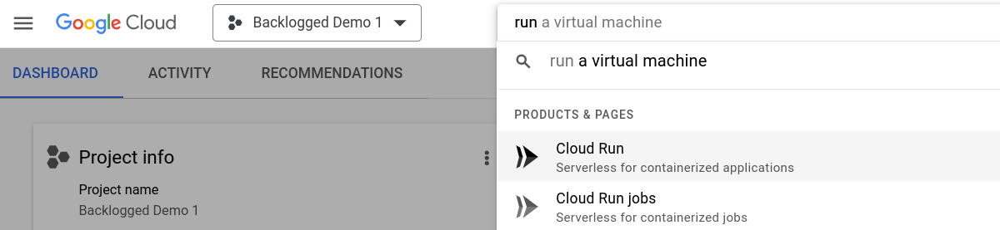
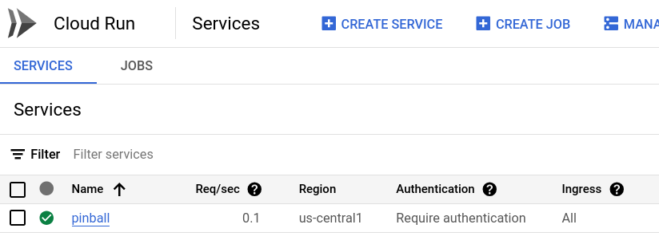
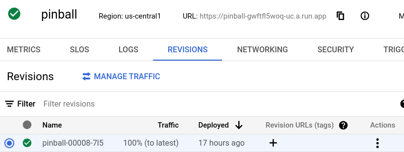
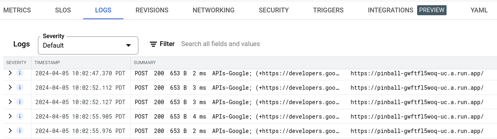

# Pinball Starter Codelab


## Introduction


In this lab, you will use  [Cloud Run](https://cloud.google.com/run/docs) and  [Cloud Pub/Sub](https://cloud.google.com/pubsub/docs) to receive messages about events from a Pinball machine, and to send messages back to be displayed on the machine. You will then add features to your Cloud Run service with aid from Gemini CodeAssist.

### What you will do...

* Use  [Cloud Shell](https://cloud.google.com/shell/docs) IDE to download code for an existing Web application.
* Edit and then deploy the application to Cloud Run.
* Extend the application's functionality using  [Gemini CodeAssist](https://cloud.google.com/gemini/docs) in Cloud Shell IDE.

### What you will learn...

* How to use Cloud Run and Cloud Pub/Sub to build a distributed application.
* How to use Gemini CodeAssist to add new features using additional Google Cloud services.

### What you will need...

You will be provided with use of a laptop already configured with:

* Chrome web browser
* A Gmail account
* A Cloud Project with billing enabled
* Gemini CodeAssist enabled for your Cloud Project

This lab is targeted to developers of all levels, including beginners. Although the available sample applications are in the Python and JavaScript languages, you don't need to be familiar with them specifically in order to understand what's going on.


## Setup


You will be given access to a laptop logged in to Google which will already have access to a Cloud Project with billing and Gemini CodeAssist available to use for this lab. Examine the project:

1. Visit  [https://console.cloud.google.com](https://console.cloud.google.com/). The correct project should already have been selected. If not, select and open the project **Backlogged Demo n**, where **n** is the number matching the laptop you are using.
2. Navigate to the **Cloud Run** page in the console. An easy way to do so is to enter Cloud Run or even just Run in the search bar, and then click the Cloud Run page:



3. There is already a Cloud Run service called **pinball** running, as you can now see. This service is already configured to receive events from real and simulated pinball machines, and such events are likely currently flowing to it:

4. Examine the service by clicking on the name **pinball**. You may notice that there is one revision of the service, which was installed as a placeholder. It just acknowledges all incoming events without processing them.

5. Click the LOGS tab, and see what has been happening in the service:

There are numerous logs of POST requests having been received and acknowledged with HTTP status 200 (which means OK).

You will create and deploy new revisions of this service that have more functionality in the following steps.


## Get and examine starter code


From the console, open the Cloud Shell by clicking on the icon that looks a bit like a terminal with a shell prompt, near the top of the page. Cloud Shell will open at the bottom of the page. Click the pop-out icon near the right top of the Cloud Shell to open it in its own window. Then click the pencil icon at the top right of the screen to open the editor and the shell prompt in the same tab. This is the IDE you will use in this lab:


Download the sample code in JavaScript and Python from GitHub by entering the following commands in the Cloud Shell prompt:

```shell
cd ~/
git clone https://github.com/GoogleCloudPlatform/backlogged-pinball-backend.git
cd backlogged-pinball-backend/sample-code
```

From there, change to the `python` or `javascript` subdirectory, depending on which language you want to use for this lab.

In the editor portion of the IDE, click the Open Folder button and select the same directory in order to view the code.

The program source files are heavily commented, explaining what they do and how they do it. Familiarize yourself with this as you will be extending the functionality soon.


## Deploy the sample code to Cloud Run


The starter source code can be directly deployed to Cloud Run with a single `gcloud` command. You can look up the Cloud Run documentation to see how, but you can also ask Gemini CodeAssist for help.

1. Sign in to Cloud Code and select your project by clicking the Cloud Code - sign in message at the bottom left of the editor:  . You may have to click it a second time to select or switch to the project you want.
2. Activate Gemini CodeAssist and select the current project by clicking the Gemini icon at the bottom right of the editor:   and selecting from the pop up menu.

If your session times out or is reopened you may have to repeat these two steps.

To ask Gemini CodeAssist for help, you click on the Gemini icon in the left bar of the editor.

You can ask Gemini questions like "How can I deploy this to Cloud Run?" However, there are many paths to get from source code to Cloud Run, and Gemini may offer any one of them. **You want to deploy with a single `gcloud` command**, so be sure to include that in your question.

You may have to answer several questions once you enter the command. The **source** code you want to deploy is in the folder you selected, you want to **require authentication**, and you want to call the resulting service **pinball**. All those options can be included in the `gcloud` command, or it will prompt for them when run.

It will take a few minutes to deploy the service. As before, take a look at the service and its logs to see what is now being done differently. The logs should now include the decoded data from each accepted Pub/Sub message.


## Add functionality to the service


The first thing you will do is add code that will show the entire received Pub/Sub message and its structure, in addition to the decoded data already showing. This will help understand message formats for the next step. Specifications for the formats are at the end of this codelab, but the actual examples in the logs should be very helpful.

Add the code following the current DEBUG log message, redeploy to Cloud Run, and examine the log messages. You may have to wait a few minutes for more messages to arrive.

Every incoming message should have fields (all strings) for the **PinballEventType**, **MachineId**, **Simulated** flag, and **GameId**. Now that you see example messages, add code to your app to extract each of these fields to local variables.

Different types of messages will have different types of information in the **data** field. Figure out how to extract any of that data you find interesting. In particular, see how to extract the **TotalScore** and **GameLengthMilliseconds** values from **GameEnded** events.

Add a log message every time a game ends that looks like the following:

```shell
"!!!!! GAME XXXX ENDED !!!!! Score 9999, lasting 8888 milliseconds on machine YYYY! Congratulations!"
```

Replace XXXX with the **GameId**, 9999 with the **TotalScore**, 8888 with the **GameLengthMilliseconds**, and YYYY with the **MachineId**.

Redeploy the app and examine the log to see if it is working.


## Send a reaction back to the Pinball machine


Right now, the sample code contains a statement to send a message to a Pinball machine. The code current never runs, since it is inside an if statement with a false condition. The code calls the **send_response** or **sendResponse** function which is now an empty stub.

You will replace the if statement's false condition with a check for a **GameEnded** event. In case of that event, the code will call send_response or sendResponse with **reaction_type** `DISPLAY_MESSAGE`, and **data** `"{MessageKey: "LUCKY", "HexColor": "#EA8600"}`. The **MachineId** should be the one from the GameEnded event.

You will replace the empty stub of the send_response or sendResponse function with one that will send the specified message to the Pub/Sub `TOPIC_ID` of project `PROJECT_ID`. Both those values are already defined and assigned in the sample code. Use Gemini CodeAssist and online documentation to write the code. The code should return the result of the Pub/Sub publishing operation.

When the physical Pinball machine receives this message, it will display the congratulatory text to the player.

Deploy the updated app and check the logs to see if successful sends a message.

You have now completed the codelab. You can explore further in the time you have, if you wish. In particular, you might want to keep track of total numbers of games, machines, or best scores or longest games. Doing so will require you to track those values in external storage, not application variables, because the serverless nature of Cloud Run means that events may end up being processed by different instances of the program, each with their own application data.

Gemini CodeAssist can help you look at the various Google Cloud data options. Look closely at Cloud Firestore as a common solution for this issue.


## Pinball Events


Pinball machines, real or simulated, can send **PinballEvent** messages describing game play. Each PinballEvent message has the following **attributes**:

| PinballEventType | String. One of the following:<ul><li><code>GameStarted</code></li><li><code>GameEnded</code></li><li><code>BallLaunched</code></li><li><code>BallDrained</code></li><li><code>MultiballStarted</code></li><li><code>TargetHit</code></li><li><code>SpinnerHit</code></li><li><code>LoopHit</code></li><li><code>ScoopHit</code></li><li><code>RampHit</code></li><li><code>ScoopHit</code></li></ul> |
| --- | --- |
| MachineId | String. Unique identifier. The real Pinball machine used at Next 2024 has MachineId <code>GBL:1</code> |
| Simulated | String. TRUE or FALSE |
| GameId | String. Unique ID generated for each game |

The form of **data** in a **PinballEvent** message depends on the PinballEventType. In each case it is a valid JSON string.

| GameStarted | Empty (i.e., <code>{}</code>) |
| --- | --- |
| GameEnded | TotalScore<br>GameLengthMilliseconds<br>RampsHit<br>LoopsHit<br>ScoopsHit |
| BallLaunched | IsMultiballLaunchedBallCountInGameTime |
| BallDrained | IsMultiballDrainedBallCountInGameMilliseconds |
| MultiballStarted | InGameTimeCurrentScore |
| TargetHit | TargetNamePointValue |
| RampHit | RampNamePointValue |
| SlingshotHit | SlingshotName |

Pinball machines can also receive messages of type PinballReaction. The **attributes** of such messages are:

| PinballReactionType | One of:<ul><li><code>DisplayMessage</code></li><li><code>Emoji</code></li><li><code>PlaySound</code></li><li><code>StartLightShow</code></li></ul> |
| --- | --- |
| MachineId | The machine that should accept and display the reaction |

The **data** depends on the PinballReactionType, is in JSON format, and includes these fields:

| DisplayMessage | MessageKey<br>HexColor |
| --- | --- |
| Emoji | EmojiName |
| PlaySound | SoundKey |
| StartLightShow | ShowKey |


